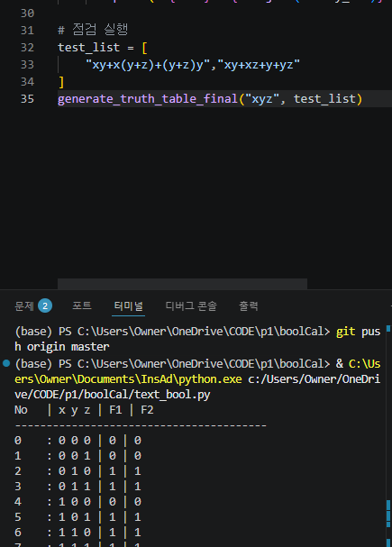

# 🚀 Boolean Logic Verifier (GUI)

이 프로그램은 복잡한 부울 함수를 진리표로 변환해주는 도구입니다.

### 📥 다운로드 및 실행
1. [Releases](링크) 페이지에서 `bool.exe`를 다운로드하세요.
2. 파이썬 설치 없이 바로 실행 가능합니다!

### 📸 실행 화면

### 🧪 논리식 검증 테스트 (CLI)
사용자가 입력한 복잡한 논리식이 정확하게 계산되는지 터미널에서 검증한 결과입니다.
